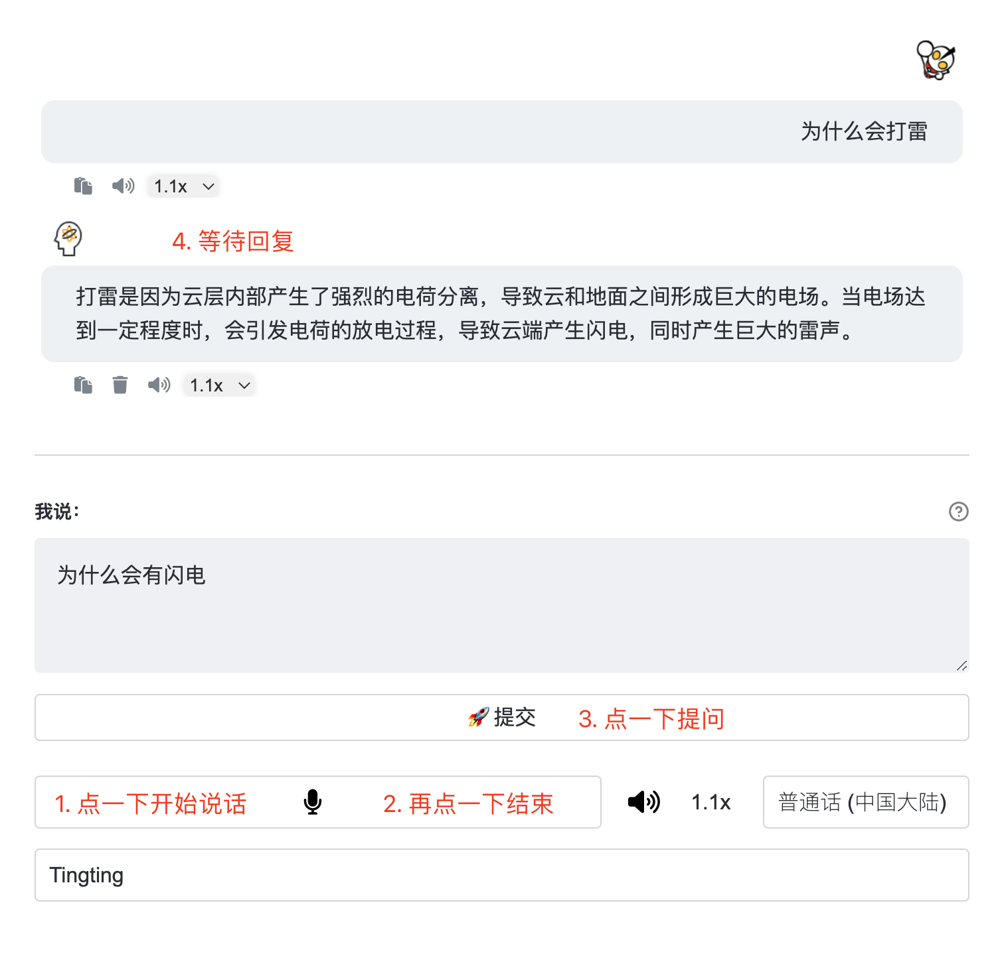

# 🤖 FreeChat
基于Streamlit搭建的ChatGPT对话助手，简单易用。


## 🤩 [已部署项目](https://freechat.streamlit.app/)
- 直接使用已部署项目，可在网页的设置选项中配置Openai Key，此时不会留存历史对话，仅在用户当前会话有效，他人不会共享。
- 自行部署项目，在Secrets中配置Openai Key后，将留存历史对话记录，此时需设置为私人应用，打造为个人GPT助理。   

# 部署

## Streamlit Cloud部署（推荐）
轻松免费部署，且无须科学上网即可使用，注意设置为私人应用。   
可参考由[@Hannah11111](https://github.com/Hannah11111)提供的[详细步骤](./Tutorial.md)。
1. `Fork`本项目到个人Github仓库。
2. 注册[Streamlit Cloud账号](https://share.streamlit.io/)，并连接到Github。（可直接选：Continue with GitHub）
3. 开始部署应用，具体可参考[官方教程](https://docs.streamlit.io/streamlit-community-cloud/get-started)。   
4. secrets配置：

```
[openai]
# 获取地址：https://platform.openai.com/account/api-keys
api_key="sk-xxx"

[auth]
# 这个不要改
cookie_key="ai_cookie"

# 授权的暗号列表，多个以空格隔开。认证通过会使用 [openai].api_key 进行对话。
valid_cookies="easyai-xxx"

# 设定密码，认证通过会使用 [openai].api_key 进行对话。
password=""
```

## 本地部署
本地部署需要科学上网。
1. 建立虚拟环境（建议）

2. 克隆项目（也可以手动下载到本地）
```bash
git clone https://github.com/ciwind/FreeChat.git
```

3. 安装依赖
```bash
pip install -r requirements.txt
```

4. 认证配置   

- 在 `.streamlit/secrets.toml`文件中写入

```
[openai]
# 获取地址：https://platform.openai.com/account/api-keys
api_key="sk-xxx"

[auth]
# 这个不要改
cookie_key="ai_cookie"

# 授权的暗号列表，多个以空格隔开。认证通过会使用 [openai].api_key 进行对话。
valid_cookies="easyai-xxx"

# 设定密码，认证通过会使用 [openai].api_key 进行对话。
password=""
```

5. 启动应用
```bash
streamlit run app.py
```

# 说明
- 在[custom.py](./tool/custom.py)文件中可自定义用户名和头像
- 在部署的项目源码中编辑[set_context.py](./tool/set_context.py)，即可增加预设定的上下文选项，会自动同步到应用中。
- 有条件的可以考虑把[helper.py](./tool/helper.py)中的文件读写逻辑改为云数据库操作，防止历史记录丢失。


# 致谢
- 基于[PierXuY/ChatGPT-Assistant](https://github.com/PierXuY/ChatGPT-Assistant)项目进行的改造，感谢。
- 主要改变：
    - 添加了认证功能，支持密码或者cookie认证，避免每次输入难记的ApiKey，公开部署无忧。
    - 简化界面、优化朗读、支持逐句回复切换（非PC端逐句回复，朗读有问题，等前端大佬来解决）

如果觉得好用，请我喝杯咖啡😄
